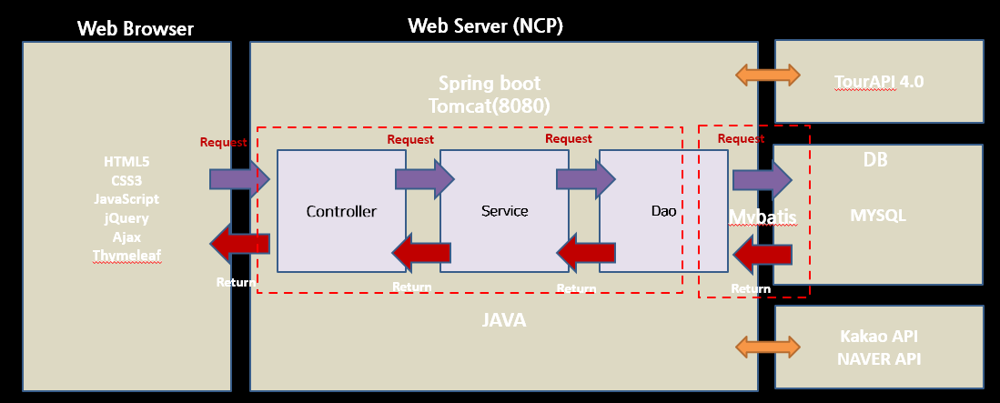
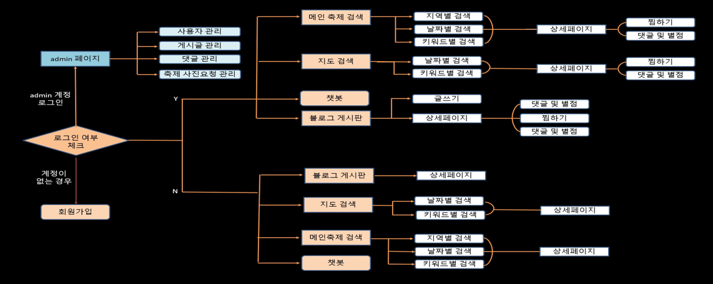
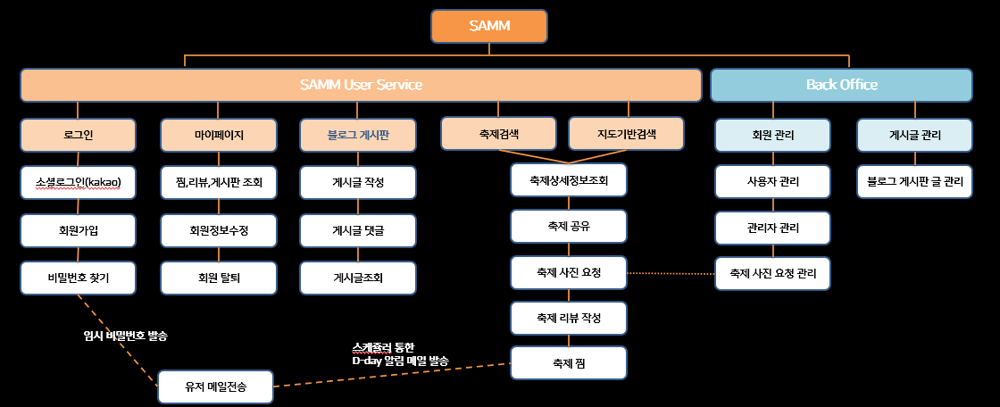
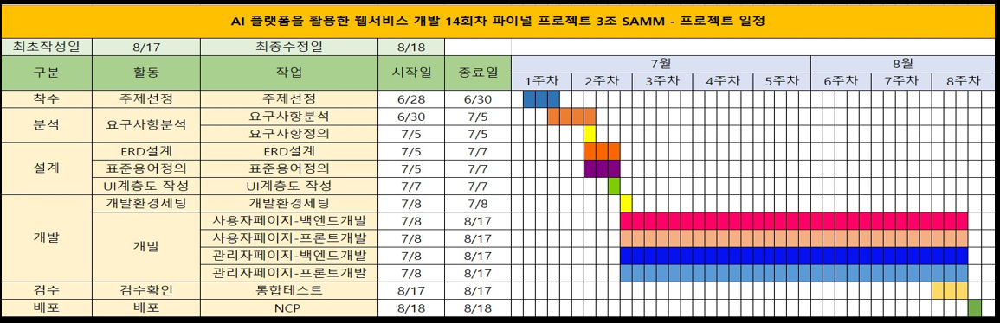
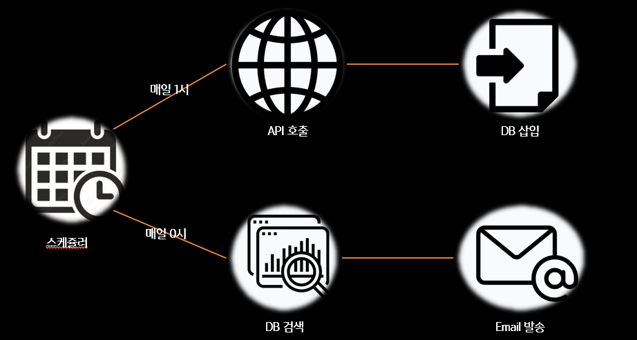

# 멀티캠퍼스 파이널 프로젝트 3조

## SAMM FESTIVAL - NCP AI플랫폼을 활용한 축제 정보 검색 맞춤 웹서비스 개발

### 프로젝트 개요

#### 개발기간 : 2022.06.26 ~ 2022.08.18 (총 52일)

#### 플랫폼 : WEB

#### 개발인원 : 4명 - 간승기(팀장), 강주성, 김유란, 이상찬

---

#### 개발 환경 

##### 언어 : `JAVA`, `HTML5/ CSS3`, `JavaScript`

##### 서버 : `NCP(NaverCloudPlatform)`, `Apache Tomacat`

##### 프레임워크 : `SpirngBoot`, `Muabatis`

##### DB : `MySQL`

##### IDE : `Eclipse`, `VSCODE`,`GitBash`,`MySQL Workbench`

##### 협업 도구 : `Git-hub`,`Notion`,`Zoom`

##### API, 라이브러리 : `Tour API4.0`, `Kakao API`,`Summer Note `,`Naver Chatbot`,`jQuery`,`Tymeleaf`

---

### 개발환경 도식화

---

### 유저플로우

---

### UI계층도

---

### ERD

---

### WBS

---

### 기능

#### 1. 스케쥴러

#### 2. 로그인 & 회원가입 

#### 3. 챗봇

#### 4. 축제 검색

#### 5. 축제 상세 기능(찜, 리뷰, 공유, 사진요청)

#### 6. 게시판 글 작성(썸머노트..)

#### 7. 어드민 페이지

